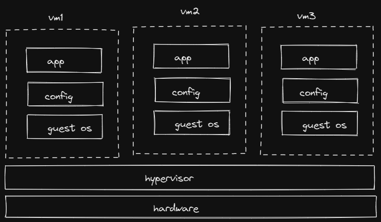
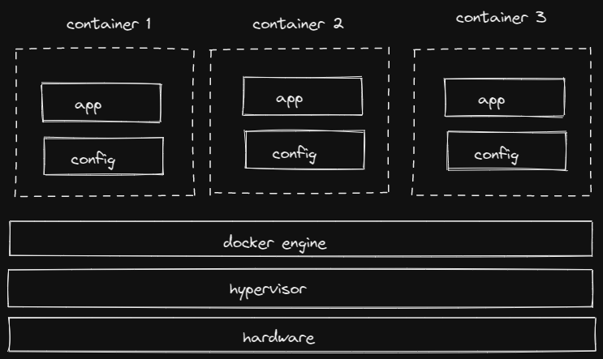
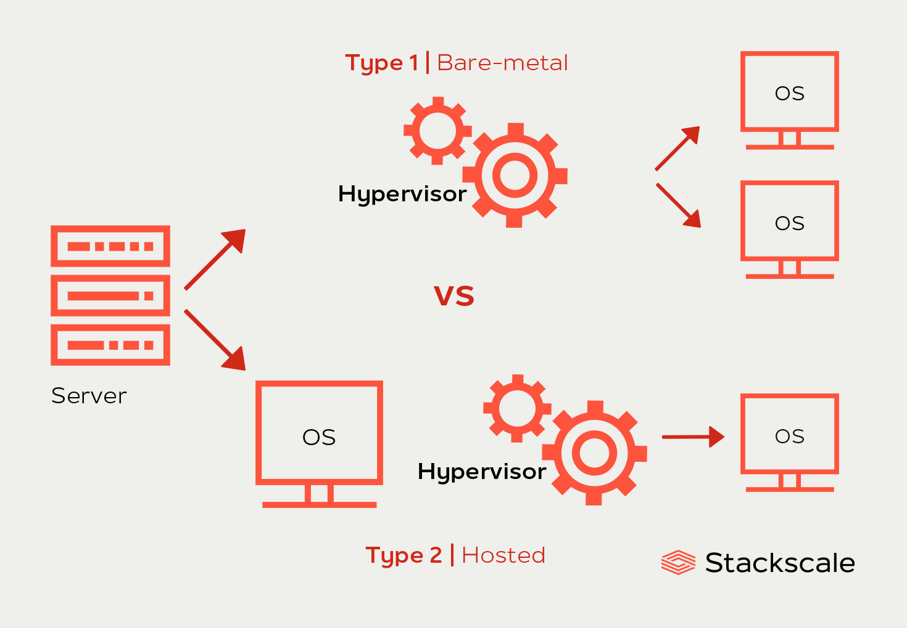
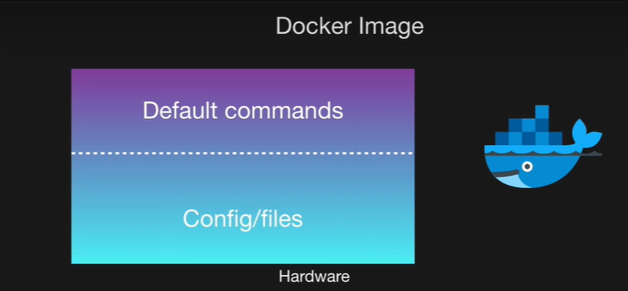
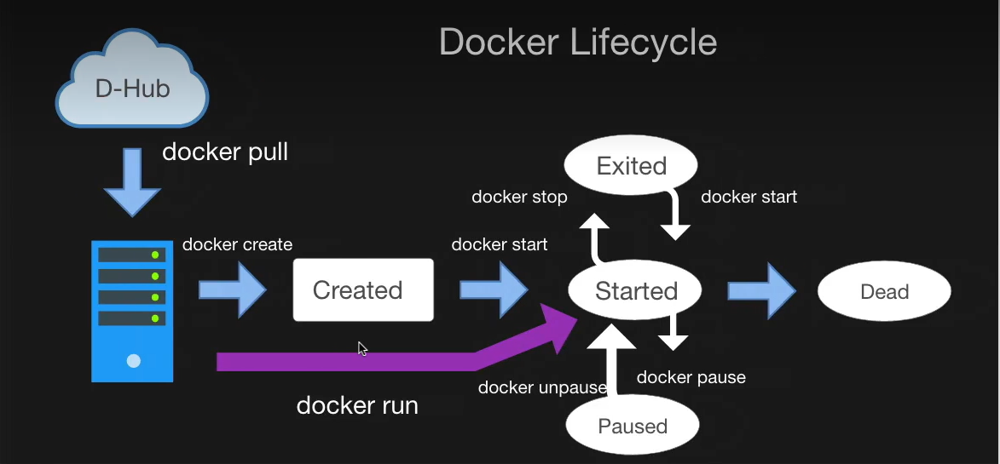
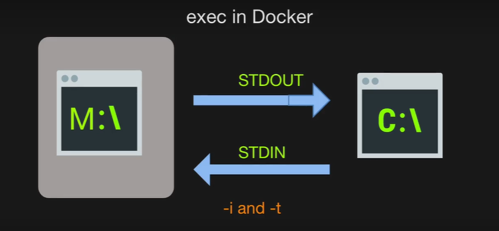
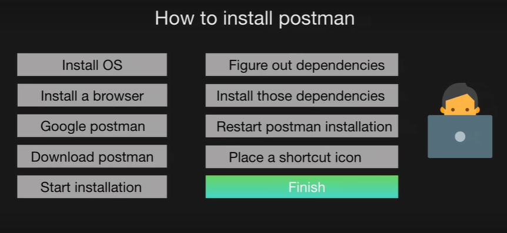
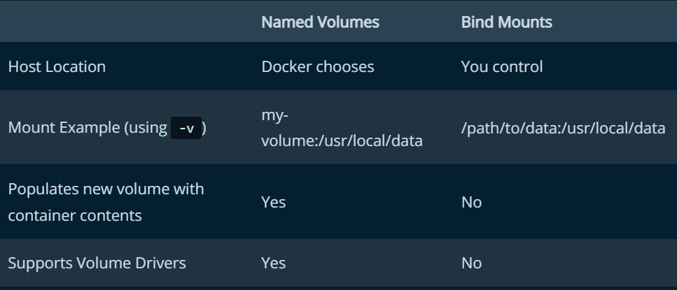

### What is Problem ?
- it's work on my machine


#### what is container ?
- [what is container](https://www.docker.com/resources/what-container/)
- [nice video](https://www.youtube.com/watch?v=3N3n9FzebAA&list=LL&index=54)

##### why Docker ?
- container -> portable
- publish on docker hub we can share the container
- docker image contains
	- code
	- dependencies
	- config
	- process
	- networking
	- some chunks of OS also

##### install docker :-
- [docker for windows](https://docs.docker.com/desktop/windows/install/)
- in case problem enable virtualization by going into boot menu
- update your wsl2
- and run below command in terminal with admin rights
```
bcdedit /set hypervisorlaunchtype auto
```

- [docker hub sign up](https://hub.docker.com/signup)
- to check docker is properly installed or not in terminal run

```
docker version  
```

- if this command give output then docker is installed in your system. 
- run first docker container

```
docker run hello-world
```

- it will pull image from docker hub and run on your local machine

- if this is working fine means your installation is proper.

Docker client -> Docker daemon -> local image storage

###### docker vs vm :-
- vm:


	- very  resource Hungary

- container:



- not that much resource Hungary

- A **hypervisor**, also known as a virtual machine monitor or VMM, is software that creates and runs virtual machines (VMs). A hypervisor allows one host computer to support multiple guest VMs by virtually sharing its resources, such as memory and processing.




#### docker images :-
- we can tell it is like snapshot at any given time




[busyBox](https://hub.docker.com/_/busybox)

```
docker pull busybox
```

```
docker run busybox ls
```
 
- print dirs of busybox not your computer.

##### docker lifecycle

```
docke ps
```

- used to show running containers

```
docker ps --all
```

- Show all containers (default shows just running)

PS = process status



- default command : execute when we start the container.

```
docker start id
```

```
docker system prune
```

- The `docker image prune` command allows you to clean up unused images. By default, `docker image prune` only cleans up _dangling_ images. A dangling image is one that is not tagged and is not referenced by any container.

- what happens inside conatiner is totaly inside not outside world is accsed of it

- `-it`  go and out of contanier 

```
docker pull mongo
```

```
PS C:\Users\BHOGAYATA JAY> docker ps -all
CONTAINER ID   IMAGE     COMMAND                  CREATED          STATUS          PORTS       NAMES
a5bc028bddea   mongo     "docker-entrypoint.s…"   34 seconds ago   Up 33 seconds   27017/tcp   condescending_cray
PS C:\Users\BHOGAYATA JAY> docker start a5bc028bddea
a5bc028bddea
PS C:\Users\BHOGAYATA JAY> docker ps -all
CONTAINER ID   IMAGE     COMMAND                  CREATED              STATUS          PORTS       NAMES
a5bc028bddea   mongo     "docker-entrypoint.s…"   About a minute ago   Up 14 seconds   27017/tcp   condescending_cray
PS C:\Users\BHOGAYATA JAY> docker exec -it a5bc028bddea bash
root@a5bc028bddea:/#
	
```

- now you are inside the mongodb container and you acn do anything you want

- ctrl + d to exit 2 
- also we can use exit

- how to stop the contanier

```
docker stop id
```

```
docker kill id
```



##### how to get into container

```
PS C:\Users\BHOGAYATA JAY> docker run -it mongo bash
```

- but do  not use above command

- but use

```
docker ps
docker start id
docker exex -it containerid bash
```

- we can also create 2 separate containers of same image

##### custom docker image:



- docker build .
- (.) in current dir Dockerfile are there. we can replace . with filename

- caching is used when top line is not changed

```
docker build -t bhogayata/imgname:version .
```

- in cmd command is array of string
---------------------------------------
 
- what is containers : a container is a sandboxed process on your machine that is isolated from all other processes on the host machine
- isolation leverages [kernel namespaces and cgroups](https://medium.com/@saschagrunert/demystifying-containers-part-i-kernel-space-2c53d6979504),
- Dockerapi or cli use to work with image
- run on any env
- portable
- is isolated from other containers and runs its own software, binaries, and configurations.
- An running instance of an image is called a container. You have an image, which is a set of layers as you describe. If you start this image, you have a running container of this image. You can have many running containers of the same image.

You can see all your images with `docker images` whereas you can see your running containers with `docker ps` (and you can see all containers with `docker ps -a`).

So a running instance of an image is a container.

```
docker run -d -p 80:80 docker/getting-started
```

- -d means in background detach mode
- -p : port mapping host port : container port
- combine tags

```
docker run -dp 80:80 docker/getting-started
```

- A Dockerfile is simply a text-based script of instructions that is used to create a container image

```
docker build -t getting-started .
```

-t : tag
. from current dir. Dockerfile

```
docker stop <the-container-id>
```


```
docker rm <the-container-id>
```

- stop and remove container
```
docker rm -f <the-container-id>
```

- remove the img
```
docker image rm -f ubuntu
```
- tagging the img

- docker tag oldname newname with hub user name

```
docker tag getting-started bhogayatajay/getting-started
```

- push to hub

```
docker push bhogayatajay/getting-started
```

 #### Persist the DB
- When a container runs, it uses the various layers from an image for its filesystem. Each container also gets its own “scratch space” to create/update/remove files. Any changes won’t be seen in another container, _even if_ they are using the same image.
- [Volumes](https://docs.docker.com/storage/volumes/) provide the ability to connect specific filesystem paths of the container back to the host machine. If a directory in the container is mounted, changes in that directory are also seen on the host machine. If we mount that same directory across container restarts, we’d see the same files.

- **named volume** to persist the data in our database : 
- create volume

```
docker volume create todo-db
```

- run app with volume : now data will remains even after we remove the container

```
 docker run -dp 3000:3000 -v todo-db:/etc/todos getting-started
```


- bind volumes 
- go inside app dir where packages.json are there and run
```
docker run -dp 3000:3000 `
     -w /app -v "$(pwd):/app" `
     node:12-alpine `
     sh -c "yarn install && yarn run dev"
```

**docker network**

- If two containers are on the same network, they can talk to each other. If they aren’t, they can’t.

- create docker network :
```
docker network create todo-app
```

- start MySQL container and attach it to the network 
```
docker run -d `
     --network todo-app --network-alias mysql `
     -v todo-mysql-data:/var/lib/mysql `
     -e MYSQL_ROOT_PASSWORD=secret `
     -e MYSQL_DATABASE=todos `
     mysql:5.7
```

- go inside the db

```
docker exec -it ad5dbcd5f5d2 mysql -u root -p
```

- now go with this
[go to docs](https://docs.docker.com/get-started/07_multi_container/)


-------------------------------------------

- A Docker image is **a file used to execute code in a Docker container**. Docker images act as a set of instructions to build a Docker container, like a template.


**all the commands**

```
docker run -d -p 80:80 docker/getting-started
```

	- d detache mode (in background)
	- p port maping machineport:dockerport
- to stop the container

```
docker stop containerid
```

- to stop remove the container in single command

```
docker rm -f containerid
```

	- f flag for force remove

- check all the process they are running 
```
docker ps -a
```

- get the list of images in local system

```
docker images
```

- remove docker image

```
docker image rm imageid
```

- how to build image from docker file

```
docker build -t myfirstimage .
```

-t for tag 

. specify current dir

- push the container on docker hub

	- create repo on the docker hub
- retag the image

```
docker tag myfirstimage bhogayatajay/myfirstimage
```

```
docker tag oldnameofimage dhubusername/imgname
```

- push image to docker hub

```
docker push bhogayatajay/todoapp
```

- pull image from hub

```
docker pull bhogayatajay/todoapp:latest
```


**named volume**
- how to create the volume
```
docker volume nameofthevolume
```
- add volume and start the container

```
docker run -dp 3000:3000 -v todo-db:/etc/todos jaybhogayata/todoapp
```

- list all the volumes

```
docker volume ls
```

- inspect the volume
```
docker volume inspect todo-db
```

**bind mounts**



- to run compose file

```
docker-compose up -d
```

```
docker-compose down
```

```
docker-compose logs -f
```

- scan the container
 
```
docker scan bhogayatajay/todoapp
```

- remove img 
```
docker rmi node-docker:v1.0.0
```


- nginx defaul dir in container
```
/usr/share/nginx/html
```